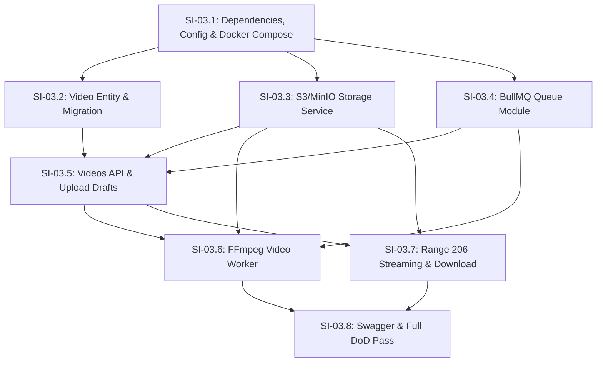

# Phase 03 — Upload e Processamento de Vídeos

## Objective

Deliver the complete video upload, processing, storage, and streaming foundation for StreamTube — direct-to-storage multipart uploads supporting files up to 10GB without API degradation, asynchronous background processing via BullMQ with FFmpeg for duration/metadata extraction and frame-accurate thumbnail generation, unique public URL slugs, HTTP Range 206 partial-content streaming, and direct user download.

---

## Step Implementations

### SI-03.1 — Dependencies, Configuration Namespaces, and Docker Compose Infrastructure

**Description:** Install all Phase 03 production and development dependencies, create `storage` and `queue` config namespaces following the established `registerAs` pattern, extend the Joi validation schema, and add `minio` (S3 object storage) and `redis` (BullMQ message broker) services to Docker Compose.

**Technical actions:**

- Install dependencies in `nestjs-project`:
  - `@nestjs/bullmq@^11.x`, `bullmq@^5.x`, `ioredis@^5.x`
  - `@aws-sdk/client-s3@^3.x`, `@aws-sdk/s3-request-presigner@^3.x`
  - `fluent-ffmpeg@^2.x`, `@types/fluent-ffmpeg@^2.x`
- Create `src/config/storage.config.ts` — `registerAs('storage', ...)` reading:
  - `STORAGE_ENDPOINT` (string, default `'http://minio:9000'`)
  - `STORAGE_REGION` (string, default `'us-east-1'`)
  - `STORAGE_ACCESS_KEY` (string, default `'minioadmin'`)
  - `STORAGE_SECRET_KEY` (string, default `'minioadmin'`)
  - `STORAGE_BUCKET_VIDEOS` (string, default `'streamtube-videos'`)
  - `STORAGE_BUCKET_THUMBNAILS` (string, default `'streamtube-thumbnails'`)
  - `STORAGE_FORCE_PATH_STYLE` (boolean, default `true`)
- Create `src/config/queue.config.ts` — `registerAs('queue', ...)` reading:
  - `REDIS_HOST` (string, default `'redis'`)
  - `REDIS_PORT` (number, default `6379`)
  - `REDIS_PASSWORD` (string, optional)
- Update `src/config/env.validation.ts` — add storage and queue variables to the Joi validation schema with defaults. Update `nestjs-project/.env.example` and `.env` with the new environment variables using Docker Compose service names (`minio`, `redis`).
- Update `nestjs-project/compose.yaml` to declare:
  - Service `redis`: image `redis:7-alpine`, port `6379:6379`, healthcheck via `redis-cli ping`.
  - Service `minio`: image `minio/minio:RELEASE.2024-11-07T00-52-28Z` (or modern stable), ports `9000:9000` (API) and `9001:9001` (Console), command `server /data --console-address ":9001"`, environment variables `MINIO_ROOT_USER=minioadmin`, `MINIO_ROOT_PASSWORD=minioadmin`.
  - Update `nestjs-api` dependencies: `depends_on` includes `redis` and `minio` with condition `service_healthy` / `service_started`.

**Dependencies:** None

**Acceptance criteria:**

- `docker compose up -d` starts `db`, `mailpit`, `redis`, `minio`, and `nestjs-api`, with all containers reaching healthy/running status.
- Starting the application reads storage and queue configurations without Joi validation errors.
- Redis responds to `PING` on port 6379 inside the Docker network.
- MinIO S3 API is reachable on port 9000 inside the Docker network.

---

### SI-03.2 — Video Entity, Status Enum, and TypeORM Migration

**Description:** Create the `Video` entity linked to `Channel` via foreign key `channel_id`, defining video metadata, storage keys, public URL slug, duration, and status state machine (`DRAFT`, `UPLOADING`, `PROCESSING`, `READY`, `FAILED`). Generate and verify the TypeORM migration.

**Technical actions:**

- Create `src/videos/enums/video-status.enum.ts`:
  ```typescript
  export enum VideoStatus {
    DRAFT = 'DRAFT',
    UPLOADING = 'UPLOADING',
    PROCESSING = 'PROCESSING',
    READY = 'READY',
    FAILED = 'FAILED',
  }
  ```
- Create `src/videos/entities/video.entity.ts`:
  - Columns:
    - `id` (uuid, PK generated via `uuid_generate_v4()`)
    - `channel_id` (uuid, FK → `channels.id`, cascade delete)
    - `title` (varchar(255), not null)
    - `description` (text, nullable)
    - `slug` (varchar(32), unique, not null — URL-safe public identifier)
    - `storage_key` (varchar(500), not null — S3 object key for video file)
    - `thumbnail_url` (varchar(500), nullable — S3 key or URL for thumbnail)
    - `duration_seconds` (integer, nullable)
    - `status` (enum `VideoStatus`, not null, default `VideoStatus.DRAFT`)
    - `error_message` (text, nullable)
    - `created_at` (CreateDateColumn)
    - `updated_at` (UpdateDateColumn)
  - Relations: `@ManyToOne(() => Channel, { onDelete: 'CASCADE' })` with `@JoinColumn({ name: 'channel_id' })`.
  - Indexes: Unique on `slug`, index on `channel_id`, index on `status`.
- Generate migration `CreateVideos` via TypeORM CLI. Ensure migration creates the Postgres enum `video_status_enum`, the `videos` table with foreign key to `channels(id)`, and the required indexes.
- Update `src/test/create-test-data-source.ts` to include `Video` in default entity lists and `cleanAllTables` in FK-safe order (`videos` deleted before `channels`).

**Tests:**

| File | Layer | Verifies |
|------|-------|----------|
| `src/videos/entities/video.entity.integration-spec.ts` | Integration | Unique slug constraint, foreign key to channel with cascade delete, default `status = DRAFT`, nullable fields |
| `src/database/migrations.integration-spec.ts` | Integration | Up and down migrations execute cleanly, creating `videos` table and `video_status_enum` |

**Dependencies:** SI-03.1

**Acceptance criteria:**

- `npm run migration:run` creates the `videos` table and `video_status_enum` type.
- Inserting a video with a duplicate slug fails with a unique constraint violation.
- Deleting a channel cascades and removes all associated video records.
- Newly created video defaults to `status = DRAFT`.

---

### SI-03.3 — S3/MinIO Storage Service and Bucket Provisioning

**Description:** Implement `StorageModule` and `StorageService` using `@aws-sdk/client-s3` and `@aws-sdk/s3-request-presigner`. Provides automated bucket initialization, presigned PUT and Multipart upload URLs, object metadata verification, and read streams supporting HTTP byte ranges.

**Technical actions:**

- Create `src/storage/storage.service.ts`:
  - Initialize `S3Client` with endpoint, credentials, and `forcePathStyle: true` from `storageConfig`.
  - `onModuleInit()`: Verify and automatically create `streamtube-videos` and `streamtube-thumbnails` buckets if they do not exist (`HeadBucketCommand` / `CreateBucketCommand`).
  - `getPresignedPutUrl(bucket: string, key: string, expiresInSeconds = 3600): Promise<string>`: Generates a presigned PUT URL for single-part uploads or thumbnails.
  - `createMultipartUpload(bucket: string, key: string): Promise<string>`: Calls `CreateMultipartUploadCommand` and returns `UploadId`.
  - `getPresignedUploadPartUrl(bucket: string, key: string, uploadId: string, partNumber: number): Promise<string>`: Generates presigned URL for specific part upload.
  - `completeMultipartUpload(bucket: string, key: string, uploadId: string, parts: { PartNumber: number; ETag: string }[]): Promise<void>`: Calls `CompleteMultipartUploadCommand`.
  - `getObjectStream(bucket: string, key: string, range?: string): Promise<{ stream: NodeJS.ReadableStream; contentLength: number; contentRange?: string; totalSize: number; contentType: string }>`: Issues `GetObjectCommand` (with `Range` header if provided) and returns readable stream and header metadata.
  - `uploadBuffer(bucket: string, key: string, buffer: Buffer, contentType: string): Promise<string>`: Direct buffer upload for thumbnails generated by the worker.
- Create `src/storage/storage.module.ts`: Export `StorageService`.

**Tests:**

| File | Layer | Verifies |
|------|-------|----------|
| `src/storage/storage.service.integration-spec.ts` | Integration | Bucket auto-creation, presigned URL generation, multipart upload round-trip, range streaming from real MinIO container |

**Dependencies:** SI-03.1

**Acceptance criteria:**

- Buckets `streamtube-videos` and `streamtube-thumbnails` are created on startup if absent.
- Presigned upload URLs allow direct PUT requests to MinIO from external clients.
- `getObjectStream` with range (e.g., `bytes=0-100`) returns the partial stream and correct `Content-Range`.

---

### SI-03.4 — Queue Module and BullMQ Producer Setup

**Description:** Configure `QueueModule` with `@nestjs/bullmq` connected to Redis, registering the `video-processing` queue. Create a strongly typed queue producer service to publish `video.process` jobs with retry policies and exponential backoff.

**Technical actions:**

- Create `src/queue/queue.constants.ts`: `VIDEO_PROCESSING_QUEUE = 'video-processing'`, `JOB_PROCESS_VIDEO = 'process-video'`.
- Create `src/queue/interfaces/process-video-job.interface.ts`:
  ```typescript
  export interface ProcessVideoJobPayload {
    videoId: string;
    storageKey: string;
    channelId: string;
  }
  ```
- Create `src/queue/queue.module.ts`:
  - `BullModule.forRootAsync({ inject: [queueConfig.KEY], useFactory: ... })` using `@nestjs/config`.
  - `BullModule.registerQueue({ name: VIDEO_PROCESSING_QUEUE })`.
  - Provide and export `VideoQueueProducer`.
- Create `src/queue/video-queue-producer.service.ts`:
  - Inject `@InjectQueue(VIDEO_PROCESSING_QUEUE) private readonly videoQueue: Queue`.
  - `addVideoProcessingJob(payload: ProcessVideoJobPayload): Promise<void>`: Enqueues job with options:
    `{ attempts: 3, backoff: { type: 'exponential', delay: 5000 }, removeOnComplete: true, removeOnFail: false }`.

**Tests:**

| File | Layer | Verifies |
|------|-------|----------|
| `src/queue/video-queue-producer.service.spec.ts` | Unit | Enqueues job with correct payload and retry options |
| `src/queue/queue.integration-spec.ts` | Integration | Connects to Redis and successfully pushes job to the queue |

**Dependencies:** SI-03.1

**Acceptance criteria:**

- `VideoQueueProducer` successfully enqueues jobs in Redis with 3 retry attempts and exponential backoff.
- Redis connection handles reconnection gracefully without crashing the app.

---

### SI-03.5 — Videos Module: Upload Initialization, Draft Creation, and Completion

**Description:** Create `VideosModule`, `VideosController`, and `VideosService`. Implement endpoints for authenticated channel owners to initialize an upload (pre-registering a video as `DRAFT` and issuing presigned S3 URLs) and complete the upload (moving to `PROCESSING` and dispatching the BullMQ job).

**Technical actions:**

- Create `src/videos/utils/video-slug.util.ts`: generates random, URL-safe alphanumeric slugs (length 10) with retry on collision.
- Create DTOs:
  - `src/videos/dto/init-upload.dto.ts`: `title` (string, required, 1-255 chars), `description` (string, optional), `file_name` (string, required), `file_size` (number, required, max 10GB = 10,737,418,240 bytes), `content_type` (string, required, e.g. `video/mp4`).
  - `src/videos/dto/complete-upload.dto.ts`: `parts` (optional array of `{ part_number, etag }` for multipart, or empty if single-part).
- Create `src/videos/videos.service.ts`:
  - `initUpload(user: JwtPayload, dto: InitUploadDto)`:
    1. Resolve user's `channel_id` (404/403 if user has no channel).
    2. Generate unique slug with collision pre-check.
    3. Generate S3 storage key: `videos/${channelId}/${slug}/${dto.file_name}`.
    4. Save `Video` entity in `status = DRAFT`.
    5. If file > 100MB, initiate multipart upload and return `upload_id` and presigned part URLs. If file <= 100MB, generate single presigned PUT URL.
    6. Return `{ video_id, slug, upload_type, upload_url, upload_id, parts_urls }`.
  - `completeUpload(videoId: string, user: JwtPayload, dto: CompleteUploadDto)`:
    1. Load video by `id`. Verify existence (404) and channel ownership (403).
    2. Validate status is `DRAFT` or `UPLOADING` (400 `INVALID_UPLOAD_STATE`).
    3. If multipart, call `storageService.completeMultipartUpload`.
    4. Update video status to `PROCESSING`.
    5. Dispatch `videoQueueProducer.addVideoProcessingJob({ videoId, storageKey, channelId })`.
    6. Return `{ message: 'Upload completed, processing started', video: video }`.
- Create `src/videos/videos.controller.ts`:
  - `@Post('init')` (Protected by `JwtAuthGuard`)
  - `@Post(':id/complete')` (Protected by `JwtAuthGuard`)
  - `@Get(':slug')` (Public with `@Public()`, returns public video metadata and playback status)

**Tests:**

| File | Layer | Verifies |
|------|-------|----------|
| `src/videos/videos.service.spec.ts` | Unit | Draft creation, slug generation, multipart vs single part decision, complete upload status transition and queue dispatch |
| `src/videos/videos.service.integration-spec.ts` | Integration | Video draft saved to PostgreSQL, status updated to `PROCESSING`, job enqueued in Redis |
| `test/videos.e2e-spec.ts` | E2E | `POST /videos/init` 201 with presigned URL, `POST /videos/:id/complete` 200, unauthorized requests return 401 |

**Dependencies:** SI-03.2, SI-03.3, SI-03.4

**Acceptance criteria:**

- Pre-registers video in `DRAFT` status before any file data is uploaded.
- Direct-to-storage presigned URLs are issued; zero media bytes flow through the NestJS API server.
- Files up to 10GB are accepted by the validation schema and multipart strategy.
- Completing upload transitions status to `PROCESSING` and enqueues a background job.

---

### SI-03.6 — Dedicated Video Worker Process & FFmpeg Processing

**Description:** Implement the background video consumer using `@Processor(VIDEO_PROCESSING_QUEUE)` and `fluent-ffmpeg`. The worker consumes the job, probes video metadata (duration, width, height), extracts a thumbnail frame at 1s (or 10% of duration), uploads the thumbnail to MinIO, and updates the `Video` status to `READY` (or `FAILED` on unrecoverable errors).

**Technical actions:**

- Docker & Toolchain setup:
  - Add `ffmpeg` and `ffprobe` packages to `Dockerfile.dev` (`apt-get install -y ffmpeg`).
  - Create worker entrypoint `src/worker.ts` running a standalone NestJS application context with `NestFactory.createApplicationContext(WorkerModule)`.
  - Add service `video-worker` to `nestjs-project/compose.yaml` using the same codebase, running `npm run start:worker:dev`.
- Create `src/worker/video-processor.worker.ts`:
  - `@Processor(VIDEO_PROCESSING_QUEUE)` extending `WorkerHost`.
  - `process(job: Job<ProcessVideoJobPayload>): Promise<void>`:
    1. Fetch video from database. If not found, abort.
    2. Fetch readable stream or download temporary chunk from S3 using `StorageService`.
    3. Run `ffprobe` to extract `duration` in seconds, `width`, `height`, and codec.
    4. Run `ffmpeg` to capture a JPEG thumbnail frame at 1.0s and save to `/tmp`.
    5. Upload thumbnail to `streamtube-thumbnails` bucket via `storageService.uploadBuffer`.
    6. Update `Video` entity: `duration_seconds = Math.round(duration)`, `thumbnail_url = thumbnailKey`, `status = READY`, `updated_at = new Date()`.
    7. In `catch`: update `Video` entity `status = FAILED`, `error_message = err.message`, and rethrow to trigger BullMQ retry.
- Add `npm run start:worker:dev` script in `package.json`.

**Tests:**

| File | Layer | Verifies |
|------|-------|----------|
| `src/worker/video-processor.worker.spec.ts` | Unit | Metadata extraction, thumbnail upload, success updates status to `READY`, error transitions to `FAILED` |
| `src/worker/video-processor.worker.integration-spec.ts` | Integration | End-to-end processing with real Redis job and real sample video file in MinIO |

**Dependencies:** SI-03.3, SI-03.4, SI-03.5

**Acceptance criteria:**

- Worker executes in an isolated container/process, preventing heavy FFmpeg workloads from impacting API responsiveness.
- Video duration and dimensions are accurately extracted and saved.
- Thumbnail is generated from a video frame and stored in the thumbnails bucket.
- Video status advances to `READY` on success, or `FAILED` with logged reason on failure.

---

### SI-03.7 — Video Streaming with Range HTTP 206 and User Download

**Description:** Implement video playback streaming and file download endpoints in `VideosController`. Streaming supports HTTP `Range` headers, returning status `206 Partial Content` with `Content-Range` and `Accept-Ranges: bytes`, piping the requested byte chunk directly from storage. Download returns the complete file with `Content-Disposition: attachment`.

**Technical actions:**

- In `src/videos/videos.service.ts`:
  - `getStream(slug: string, rangeHeader?: string)`:
    1. Query video by `slug`. If not found, throw `VideoNotFoundException` (404).
    2. Check `status === VideoStatus.READY` (if not ready, throw `VideoNotReadyException` 400).
    3. Call `storageService.getObjectStream(videosBucket, video.storage_key, rangeHeader)`.
    4. Return stream and response headers (`Content-Range`, `Accept-Ranges`, `Content-Length`, `Content-Type`).
  - `getDownloadStream(slug: string)`:
    1. Query video by `slug` (404 if not found, 400 if not ready).
    2. Call `storageService.getObjectStream(videosBucket, video.storage_key)`.
    3. Return stream, content length, and sanitized filename for `Content-Disposition`.
- In `src/videos/videos.controller.ts`:
  - `@Get(':slug/stream')` with `@Public()`: Read `@Headers('range') range`, set HTTP status to `206` (or `200` if no range), pipe `stream` to Express `res`.
  - `@Get(':slug/download')` with `@Public()`: Set `Content-Disposition: attachment; filename="${filename}"`, pipe `stream` to Express `res`.

**Tests:**

| File | Layer | Verifies |
|------|-------|----------|
| `src/videos/videos.streaming.integration-spec.ts` | Integration | `GET /videos/:slug/stream` responds 206 with correct `Content-Range` chunk for valid byte range, responds 400 when video not ready |
| `test/videos.e2e-spec.ts` | E2E | Streaming seeks and chunk delivery, download endpoint returns attachment headers |

**Dependencies:** SI-03.3, SI-03.5, SI-03.6

**Acceptance criteria:**

- `GET /videos/:slug/stream` without Range header returns full content or initial chunk.
- `GET /videos/:slug/stream` with `Range: bytes=0-1048575` returns `206 Partial Content`, `Content-Range: bytes 0-1048575/<total>`, and exact 1MB payload.
- `GET /videos/:slug/download` triggers file download with attachment header.
- Unprocessed (`DRAFT`, `PROCESSING`, `FAILED`) videos return `400 VIDEO_NOT_READY`.

---

### SI-03.8 — OpenAPI/Swagger Documentation, Export, and Complete DoD Verification

**Description:** Annotate all new endpoints and DTOs with Swagger/OpenAPI decorators (`@ApiTags`, `@ApiOperation`, `@ApiResponse`, `@ApiConsumes`, `@ApiBearerAuth`), export the updated `openapi.json`, and run the entire verification suite (unit, integration, e2e, tsc, lint).

**Technical actions:**

- Add `@ApiTags('videos')` to `VideosController`.
- Decorate all endpoints with appropriate HTTP status codes, request bodies, and error response schemas.
- Update `scripts/sync-openapi.sh` / run `npm run openapi:export` to update `nestjs-project/openapi.json`.
- Run full suite: `npm test -- --runInBand`, `npm run test:e2e`, `npx tsc --noEmit`, `npm run lint`.
- Update `progress.md` marking all SIs completed.

**Tests:**

| File | Layer | Verifies |
|------|-------|----------|
| `src/openapi-export.integration-spec.ts` | Integration | OpenAPI schema is valid and contains `/videos` endpoints |

**Dependencies:** SI-03.1 through SI-03.7

**Acceptance criteria:**

- `openapi.json` contains full schemas and contracts for video endpoints.
- Full unit and integration test suites pass (`npm test -- --runInBand`).
- Full e2e test suite passes (`npm run test:e2e`).
- TypeScript compiles cleanly (`npx tsc --noEmit` code 0).
- ESLint reports 0 errors (`npm run lint`).

---

## 3. Dependency Map



---

## 4. Technical Specifications

### Data Model

#### Video

| Column | Type | Constraints | Notes |
|--------|------|-------------|-------|
| `id` | uuid | PK, generated | `uuid_generate_v4()` |
| `channel_id` | uuid | FK → `channels.id`, not null | Owning channel (cascade delete) |
| `title` | varchar(255) | not null | Video title |
| `description` | text | nullable | Video description |
| `slug` | varchar(32) | unique, not null | Collision-resistant public identifier |
| `storage_key` | varchar(500) | not null | S3 object key in video bucket |
| `thumbnail_url` | varchar(500) | nullable | S3 object key/URL in thumbnail bucket |
| `duration_seconds` | integer | nullable | Duration extracted by FFprobe |
| `status` | enum (`VideoStatus`) | not null, default `DRAFT` | `DRAFT`, `UPLOADING`, `PROCESSING`, `READY`, `FAILED` |
| `error_message` | text | nullable | Failure reason if processing fails |
| `created_at` | timestamp | not null, auto-generated | `@CreateDateColumn` |
| `updated_at` | timestamp | not null, auto-generated | `@UpdateDateColumn` |

**Relations:** Video → Channel (many-to-one, `@JoinColumn({ name: 'channel_id' })`)  
**Indexes:** `(slug)` — unique, `(channel_id)`, `(status)`

---

### API Contracts

#### POST /videos/init (SI-03.5)
**Auth:** Bearer JWT required  
**Request Body:**
- `title`: string, required (1-255 characters)
- `description`: string, optional
- `file_name`: string, required
- `file_size`: number, required (max 10,737,418,240 bytes / 10GB)
- `content_type`: string, required (e.g. `'video/mp4'`)

**Response 201:**
```json
{
  "video_id": "9b1deb4d-3b7d-4bad-9bdd-2b0d7b3dcb6d",
  "slug": "xK9mP2qLw1",
  "upload_type": "multipart",
  "upload_id": "VXBsb2FkIElEIGV4YW1wbGU",
  "key": "videos/channel-uuid/xK9mP2qLw1/sample.mp4",
  "parts_urls": [
    { "part_number": 1, "url": "http://minio:9000/streamtube-videos/...?partNumber=1..." }
  ]
}
```

---

#### POST /videos/:id/complete (SI-03.5)
**Auth:** Bearer JWT required  
**Request Body:**
- `parts`: array of `{ part_number: number, etag: string }` (required for multipart)

**Response 200:**
```json
{
  "message": "Upload completed, processing queued",
  "video_id": "9b1deb4d-3b7d-4bad-9bdd-2b0d7b3dcb6d",
  "status": "PROCESSING"
}
```

---

#### GET /videos/:slug (SI-03.5)
**Auth:** Public  
**Response 200:**
```json
{
  "id": "9b1deb4d-3b7d-4bad-9bdd-2b0d7b3dcb6d",
  "title": "My First Video",
  "description": "Video description",
  "slug": "xK9mP2qLw1",
  "status": "READY",
  "duration_seconds": 128,
  "thumbnail_url": "/thumbnails/thumb.jpg",
  "channel_id": "channel-uuid",
  "created_at": "2026-04-08T12:00:00Z"
}
```

---

#### GET /videos/:slug/stream (SI-03.7)
**Auth:** Public  
**Request Headers:** `Range: bytes=0-1048576` (optional)  
**Response 206 (Partial Content):**
- Headers:
  - `Content-Range: bytes 0-1048576/52428800`
  - `Accept-Ranges: bytes`
  - `Content-Length: 1048577`
  - `Content-Type: video/mp4`
- Body: binary video stream chunk

---

#### GET /videos/:slug/download (SI-03.7)
**Auth:** Public  
**Response 200:**
- Headers:
  - `Content-Disposition: attachment; filename="my-first-video.mp4"`
  - `Content-Type: video/mp4`
- Body: binary file stream

---

### Authorization Matrix

| Endpoint | Public | Authenticated | Channel Owner Only | Notes |
| :--- | :---: | :---: | :---: | :--- |
| `POST /videos/init` | | ✓ | ✓ | Must have an active channel |
| `POST /videos/:id/complete` | | ✓ | ✓ | Only owner can finalize upload |
| `GET /videos/:slug` | ✓ | | | Public access |
| `GET /videos/:slug/stream` | ✓ | | | Public streaming |
| `GET /videos/:slug/download` | ✓ | | | Public download |

---

### Events & Messages (BullMQ)

**Queue Name:** `video-processing`  
**Job Name:** `process-video`  
**Payload:**
```typescript
{
  "videoId": "uuid",
  "storageKey": "videos/channel-id/slug/file.mp4",
  "channelId": "uuid"
}
```
**Options:**
- `attempts`: 3
- `backoff`: `{ type: 'exponential', delay: 5000 }`
- `removeOnComplete`: true
- `removeOnFail`: false (preserved for inspection and dead-letter handling)

---

### Error Catalog

| Error Code | HTTP Status | Trigger Condition |
| :--- | :---: | :--- |
| `VIDEO_NOT_FOUND` | 404 | Video ID or slug does not exist |
| `CHANNEL_NOT_FOUND` | 404 | User does not have an associated channel |
| `FORBIDDEN_RESOURCE` | 403 | User attempts to complete upload on another channel's video |
| `INVALID_UPLOAD_STATE` | 400 | Attempt to complete upload when status is not `DRAFT`/`UPLOADING` |
| `FILE_TOO_LARGE` | 400 | Initiated file size exceeds 10GB limit |
| `VIDEO_NOT_READY` | 400 | Attempt to stream or download a video whose status is not `READY` |
| `STORAGE_OPERATION_FAILED` | 500 | MinIO/S3 connection, bucket, or presign operation failed |
| `QUEUE_OPERATION_FAILED` | 500 | Redis/BullMQ job dispatch failure |

